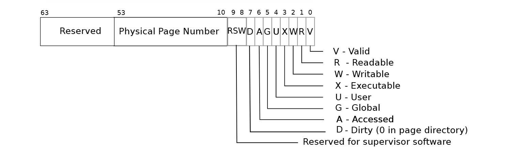
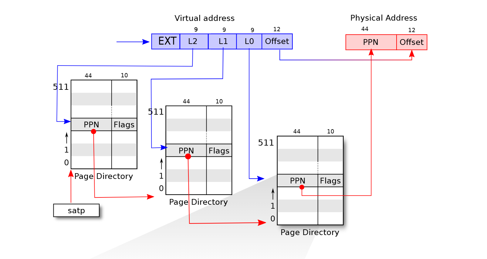
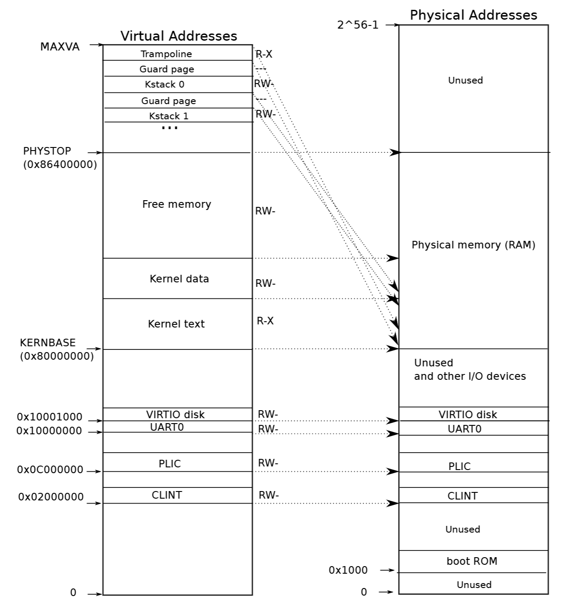
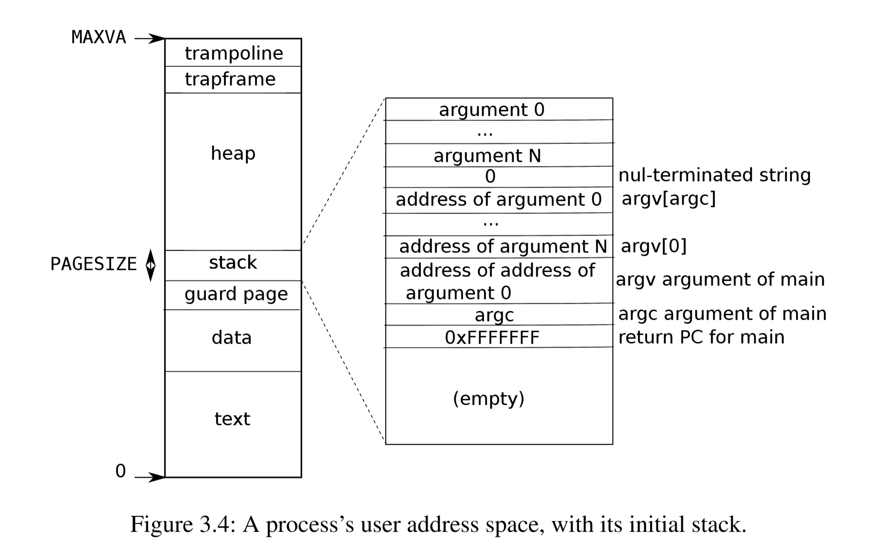

# Pre

## xv6的页表机制

xv6采用64位地址，一页大小为4KB(4096B)

xv6的页表项（64位）

- 页表项代表的页的物理地址（10~53）
- 页表的操作权限（0~9）



xv6的虚拟地址（64位）➡物理地址转换

一级页表L2+二级页表L1+三级页表L0+三级页表中的偏移量Offset（9+9+9+12）




内核拥有自己的页表。当进程进入内核态时，操作系统将内核根页表存入页表基地址寄存器；进程退出内核态时切换回进程根页表。

进程在内核态执行程序时，使用内核根页表找到内核程序中虚拟地址对应的物理地址。

## xv6内核视角下，虚拟地址与物理地址对应关系

**低于0x80000000**：分配给I/O设备，作为外部设备的寄存器

- direct mapping
- memory-mapped：内核处理这个范围的虚拟地址时直接定位对应的物理地址，即外部设备接口，不需要通过RAM访问外部设备。

**0x80000000~PHYSTOP（0x86400000）**：存储内核程序、数据

- kernel text：内核代码，R-X，direct mapping
- kernel data：RW-，防止恶意程序写入kernel data并执行
- kernel stack：系统会为每个进程分配一页保护页（Guard page）以及一页内核栈（Kstack）。保护页有效位被设置为 0 ，并且不分配对应的物理页。Kstack发生溢出，数据试图进入Guard page，由于Guard page无法转换为有效的物理地址，会触发缺页异常（page fault） 
- trampoline：RX-，



xv6内核启动（kernel/main.c），创建内核页表：

- 申请一个空页表
- 关联IO设备的地址
- 关联内核程序，内核程序已成功加载到物理地址范围为 `KERNBASE` 至 `exect` 的区域，起始虚拟地址设定为 `KERNBASE`
- 关联trampoline
- 从最高虚拟地址往下，为每个进程分配一个内核栈页

```C++
#define TRAMPOLINE (MAXVA - PGSIZE)
#define KERNBASE 0x80000000L
#define PHYSTOP (KERNBASE + 128*1024*1024)

extern char trampoline[]; // trampoline.S
extern char etext[];  // kernel.ld sets this to end of kernel code.

// Initialize the one kernel_pagetable
void
kvminit(void)
{
  kernel_pagetable = kvmmake();
}

// Make a direct-map page table for the kernel.
pagetable_t
kvmmake(void)
{
  pagetable_t kpgtbl;

  kpgtbl = (pagetable_t) kalloc();
  memset(kpgtbl, 0, PGSIZE);

  // uart registers
  kvmmap(kpgtbl, UART0, UART0, PGSIZE, PTE_R | PTE_W);

  // virtio mmio disk interface
  kvmmap(kpgtbl, VIRTIO0, VIRTIO0, PGSIZE, PTE_R | PTE_W);

  // PLIC
  kvmmap(kpgtbl, PLIC, PLIC, 0x400000, PTE_R | PTE_W);

  // map kernel text executable and read-only.
  kvmmap(kpgtbl, KERNBASE, KERNBASE, (uint64)etext-KERNBASE, PTE_R | PTE_X);

  // map kernel data and the physical RAM we'll make use of.
  kvmmap(kpgtbl, (uint64)etext, (uint64)etext, PHYSTOP-(uint64)etext, PTE_R | PTE_W);

  // map the trampoline for trap entry/exit to
  // the highest virtual address in the kernel.
  kvmmap(kpgtbl, TRAMPOLINE, (uint64)trampoline, PGSIZE, PTE_R | PTE_X);

  // map kernel stacks
  proc_mapstacks(kpgtbl);
  
  return kpgtbl;
}
```

进程处于内核态时栈的分配：

```C++
// map kernel stacks beneath the trampoline,
// each surrounded by invalid guard pages.
#define KSTACK(p) (TRAMPOLINE - ((p)+1)* 2*PGSIZE)

// Allocate a page for each process's kernel stack.
// Map it high in memory, followed by an invalid
// guard page.
void
proc_mapstacks(pagetable_t kpgtbl) {
  struct proc *p;
  
  for(p = proc; p < &proc[NPROC]; p++) {
    char *pa = kalloc();
    if(pa == 0)
      panic("kalloc");
    uint64 va = KSTACK((int) (p - proc));
    kvmmap(kpgtbl, va, (uint64)pa, PGSIZE, PTE_R | PTE_W);
  }
}
```

## xv6进程在用户态下，虚拟内存空间分布

- text：代码区
- data：静态数据区
- stack：栈
- guard page：位于栈和数据区之间，避免栈溢出越界覆盖数据区
- heap：堆
- trampframe：进程信息
- trampoline：存储切换内核态的指令



xv6创建用户进程，内存初始化：创建进程三级页表 + 加载程序

① 创建进程三级页表

- 申请一个空页表
- 将trampoline、trapframe的物理页表地址与虚拟地址联系起来
  - trapframe页表之前已经申请了，其首地址为p->trapframe
  - trampoline一段声明在trampoline.S中的程序，用于实现内核用户态之间的切换。所有进程的trampoline虚拟地址都映射到同一物理地址。


```C
#define MAXVA (1L << (9 + 9 + 9 + 12 - 1))
#define TRAMPOLINE (MAXVA - PGSIZE)
#define TRAPFRAME (TRAMPOLINE - PGSIZE)

extern char trampoline[]; // trampoline.S

// Create a user page table for a given process,
// with no user memory, but with trampoline pages.
pagetable_t
proc_pagetable(struct proc *p)
{
  pagetable_t pagetable;

  // An empty page table.
  pagetable = uvmcreate();
  if(pagetable == 0)
    return 0;

  // map the trampoline code (for system call return)
  // at the highest user virtual address.
  // only the supervisor uses it, on the way
  // to/from user space, so not PTE_U.
  if(mappages(pagetable, TRAMPOLINE, PGSIZE,
              (uint64)trampoline, PTE_R | PTE_X) < 0){
    uvmfree(pagetable, 0);
    return 0;
  }

  // map the trapframe just below TRAMPOLINE, for trampoline.S.
  if(mappages(pagetable, TRAPFRAME, PGSIZE,
              (uint64)(p->trapframe), PTE_R | PTE_W) < 0){
    uvmunmap(pagetable, TRAMPOLINE, 1, 0);
    uvmfree(pagetable, 0);
    return 0;
  }

  return pagetable;
}
```

② 加载进程程序

- src指针指向用户空间中存放进程代码的位置
- 用户进程统一从虚拟地址0映射程序，物理地址不是src，而是内核程序申请用于存放程序的页的物理地址
- 需要设置PTE_U=1，允许进程处于用户态时访问

```C
void
uvminit(pagetable_t pagetable, uchar *src, uint sz)
{
  char *mem;

  if(sz >= PGSIZE)
    panic("inituvm: more than a page");
  mem = kalloc();
  memset(mem, 0, PGSIZE);
  mappages(pagetable, 0, PGSIZE, (uint64)mem, PTE_W|PTE_R|PTE_X|PTE_U);
  memmove(mem, src, sz);
}
```

清除用户内存：

- 消除关联，否则会报错panic("freewalk: leaf");
- 递归清除页表：对于每个页表，先清除页表项为0，再回首页表

```C++
void
freewalk(pagetable_t pagetable)
{
  // there are 2^9 = 512 PTEs in a page table.
  for(int i = 0; i < 512; i++){
    pte_t pte = pagetable[i];
    if((pte & PTE_V) && (pte & (PTE_R|PTE_W|PTE_X)) == 0){
      // this PTE points to a lower-level page table.
      uint64 child = PTE2PA(pte);
      freewalk((pagetable_t)child);
      pagetable[i] = 0;
    } else if(pte & PTE_V){
      panic("freewalk: leaf");
    }
  }
  kfree((void*)pagetable);
}

// Free user memory pages,
// then free page-table pages.
void
uvmfree(pagetable_t pagetable, uint64 sz)
{
  if(sz > 0)
    uvmunmap(pagetable, 0, PGROUNDUP(sz)/PGSIZE, 1);
  freewalk(pagetable);
}
```

## 内存物理空间管理器

**kernel/kalloc.h**

分配的地址为[内核空间~PHYSTOP]

以一个页表为单位进行分配/回收

通过链表追踪可用的空闲页表地址，allocator只有一个kmem内存空间，链表上的其他结点信息均存储在空闲页表的首部

## 内存管理程序

映射虚拟地址➡物理地址mappages：自起始虚拟地址 `va` 起，连续 `pa` 字节的虚拟地址空间映射至起始于 `pa` 的物理地址空间

- 不是直接从va算起，需计算起始地址对应页的首地址
- 循环处理每一页，包括检查该页是否已经被申请，设置对应的物理地址（函数参数）、有效位、权限

```C++
int
mappages(pagetable_t pagetable, uint64 va, uint64 size, uint64 pa, int perm)
{
  uint64 a, last;
  pte_t *pte;

  if(size == 0)
    panic("mappages: size");
  
  a = PGROUNDDOWN(va);
  last = PGROUNDDOWN(va + size - 1);
  for(;;){
    if((pte = walk(pagetable, a, 1)) == 0)
      return -1;
    if(*pte & PTE_V)
      panic("mappages: remap");
    *pte = PA2PTE(pa) | perm | PTE_V;
    if(a == last)
      break;
    a += PGSIZE;
    pa += PGSIZE;
  }
  return 0;
}
```

给定虚拟地址➡物理地址 walk：在给定的三级页表中，查找虚拟地址 `va` 对应的页表项

```C++
pte_t *
walk(pagetable_t pagetable, uint64 va, int alloc)
{
  if(va >= MAXVA)
    panic("walk");

  for(int level = 2; level > 0; level--) {
    pte_t *pte = &pagetable[PX(level, va)];
    if(*pte & PTE_V) {
      pagetable = (pagetable_t)PTE2PA(*pte);
    } else {
      if(!alloc || (pagetable = (pde_t*)kalloc()) == 0)
        return 0;
      memset(pagetable, 0, PGSIZE);
      *pte = PA2PTE(pagetable) | PTE_V;
    }
  }
  return &pagetable[PX(0, va)];
}
```


# Lab3: page tables

## 1 Speed up system calls

### 题目

创建进程时，在虚拟地址`USYSCALL`映射一个只读页面。在此页面的开头，存储一个结构体`usyscall`（也在`memlayout.h`中定义），并以当前进程PID初始化该结构体。

### 思路

1. 在`proc.h`中增加`struct usyscall *usyscall`字段，用于存储共享页指针
2. `allocproc()`（进程创建时向内存申请空闲页）：申请新页，并将该页的指针地址存入`p->usyscall`字段中
3. `proc_pagetable()`（初始化进程虚拟内存空间，即申请用户内存空间的一级页表并实现已申请的特殊页的映射）：map USYSCALL页的物理地址和`USYSCALL`虚拟地址，形成的页表项添加到当前函数的页表中，设置该页权限为只读+**允许用户访问**，<span style="color:#CC0000;">map失败要unmap之前成功map的页</span>
4. `proc_freepagetable()`（释放用户内存空间的二级页表）：<span style="color:#CC0000;">unmap usyscall页</span>
5. `freeproc()`（进程销毁时清空该进程所占资源）：使用`kfree()`清除`p->usyscall`指向的物理页，对应的p->usyscall设置为0

> 报错：【panic：freewalk：leaf】
>
> 定位：只有uvmfree调用了freewalk；多处调用uvmfree之前使用uvunmap unmap页表项
>
> 释放页表之前，要先unmap页表的对应关系，即清除pte中的PTE_V为0：
>
> - 三、二级页表：(pte & PTE_V) && (pte & (PTE_R|PTE_W|PTE_X)) == 0
> - 一级页表：pte & PTE_V == 1
>
> freewalk在释放一级页表时，如果一级页表项是有效的（pte & PTE_V == 1），则发生上述错误
>
> 所以调用freewalk之前，需要unmap一级页表页表项

### 源码

**kernel/proc.h**

```C
// struct proc
struct usyscall *usyscall;
```

**kernel/proc.c**

```C
void allocproc()
{
  // Allocate a USYSCALL page for kernel to share with
  if((p->usyscallpage = (pagetable_t)kalloc()) == 0){
    freeproc(p);
    release(&p->lock);
    return 0;
  }
  p->usyscall->pid = p->pid;
}

void proc_pagetable()
{
    // map the usyscall just below USYSCALL
    if(mappages(pagetable, USYSCALL, PGSIZE,
              (uint64)(p->usyscall), PTE_R | PTE_U) < 0){
        uvmunmap(pagetable, USYSCALL, 1, 0);
        uvmfree(pagetable, 0);
        return 0;
    }
}

void freeproc()
{
  if(p->usyscall)
    kfree((void*)p->usyscall);
  p->usyscall = 0; 
}


// proc_freepagetable
  uvmunmap(pagetable, USYSCALL, 1, 0);
```


## 2 Print a page table​​

### 题目

定义`vmprint(pagetable_t)`函数，打印`pagetable_t`页表及子页表中所有合法页表项的内容

### 思路

定义两个函数：`vmprint`、`vmsprint`

`vmsprint(pagetable_t)`

1. 遍历`pagetable_t`页表所有页表项
2. 若当前页表项`pte_t`是合法的，打印相关信息
3. 版本一：若当前页表项合法并且不存在RWX在权限，说明该页表项所指向的页表不是零级页表，递归调用`vmsprint`函数，打印当前页表项所指向的页表
4. 版本二：无论当前页表项是不是指向零级页表，都进行递归，但是`vmsprint`函数需要增加一个`level`c参数，表示当前页表是第几级页表。若是第三级，表示当前页表是零级页表，退出，不需要进行递归。

### 源码

**kernel/vm.c**

```c++
void
vmprint(pagetable_t pagetable)
{
  printf("page table %p\n", pagetable);
  vmsprint(pagetable, 1);
}

void 
vmsprint(pagetable_t pagetable, int depth)
{
  if(depth == 4)
    return;
        
  pte_t pte;
  uint64 child;

  for(int i = 0; i < 512; ++i) {
    pte = pagetable[i];
    if(pte & PTE_V) {
      printf("..");
      for(int k = 1; k < depth; ++k) {
        printf(" ..");
      }
      child = PTE2PA(pte);
      printf("%d: pte %p pa %p\n", i, pte, child);
      vmsprint((pagetable_t)child, depth+1);
    }
  }
}
```

C语言中，使用`%p`占位符打印指针变量的值，也就是虚拟地址。

```C
int *p;
printf("the address is %p\n", p);
```


## 3 Detecting which pages have been accessed​

### 题目

实现`pgaccess`系统调用，汇报哪些page在上次该系统调用之前被修改或访问过。包含以下三个参数：

- va：要检查的第一个user page的虚拟地址
- checknum：待检查页数
- dstva：位于用户空间，用于存储结果的缓冲区的虚拟地址（最低位对应第一页）

### 思路

获取`pgaccess()`系统调用的参数

对于每一待检查的页：

1. 计算该页虚拟首地址va
2. 基于walk函数，获取虚拟地址va在一级页表中的页表项<span style="color:#CC0000;">（第29行代码错误，未获取最后一次PTE）</span>
3. 依据页表项的具体数值，对`PTE_A`进行检查。若`PTE_A`已被置位，就把该页的标识符写入掩码（mask）里。同时，为避免对后续检查产生干扰，需清除`PTE_A`标记
4. 使用`copyout()`将结果写回用户空间

### 源码

```C++
uint64
sys_pgaccess(void) {
	uint64 va, dstva, mask = 0L;
	int checknum;
    
	if(argaddr(0, &va) < 0)
	  return -1;
	if(va >= MAXVA) {
		panic("pgaccess virtual address no more than MAXVA");
		return -1;
	}
	if(argint(1, &checknum) < 0) 
	  return -1;
	if(checknum > 64)
	  checknum = 64;
	if(argaddr(2, &dstva) < 0)
	  return -1;
    
	struct proc *p = myproc();
    
	for (int i = 0; i < checknum; ++i) {
		pte_t *pte;
		pagetable_t pagetable = p->pagetable;
        
		for (int level = 2; level > 0; --level) {
			pte = &pagetable[PX(level, va)];
			pagetable = (pagetable_t)PTE2PA(*pte);
		}
		pte = &pagetable[PX(0, va)];
        
		if(*pte & PTE_A) {
			mask |= 1 << i;
			*pte &= (~PTE_A);
		}
		va += PGSIZE;
	}
    
	if(copyout(p->pagetable, dstva, (char *)&mask, (uint64)(sizeof(mask))) < 0)
	  return -1;
    
	return 0;
}
```

